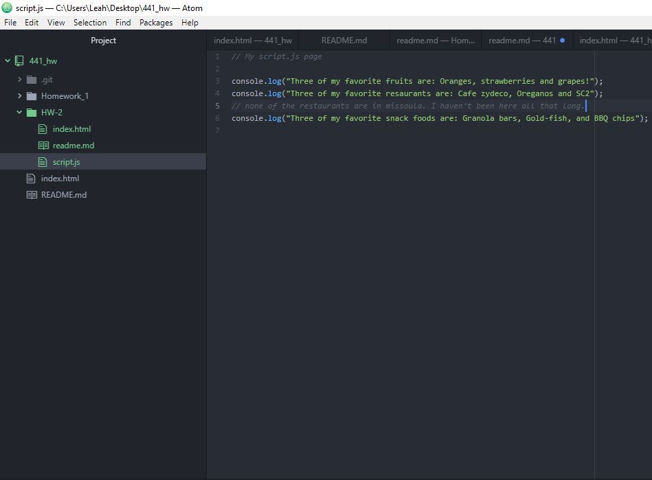

## Week 2  

### My work week

This week I went through the material on the course site a couple times over. The extra JavaScript resources were interesting and helpful.

### Intro to JavaScript

I've used JavaScript before, but never in the context of a web browser. It was interesting to set these pages up. I had no bugs this week in the code. I'm excited to move forward with this language!

