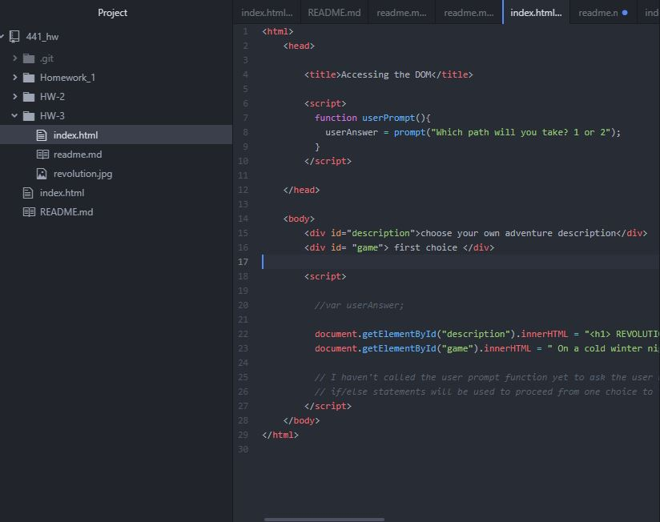

## Week 3

### my work week
 I spent the week going over the material on the website as usual. It was fun getting back into a more familiar type of coding although the combination of javaScript and html is still quite new.

 ### My code
 This weeks homework was interesting. I spent a lot of time trying to get an if/else statement to work to progress the story to the next line, but I'm running into a timing issue with the user prompt. I can't seem to get the prompt to pop up <i> after </i> the beginning of the story. After going over the requirements though it seemed as if this week as just focusing on printing on the screen more-so than progressing forward. I put comments in where I plan to progress.

 #### response to your grading comments
 I don't know where else to respond to your comments! so I'm going to here! First of all, I've been reading Spider-Gwen and catching up on the Soule run of Daredevil. I love x-men, but haven't read any for a while! As for week 2, you absolutely should try Cafe Zydeco! It's delicious!

 
