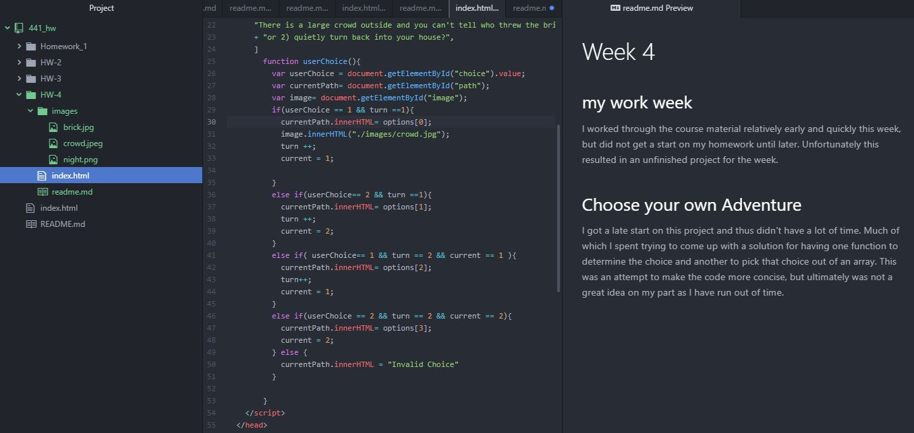

# Week 4

## my work week
I worked through the course material relatively early and quickly this week, but did not get a start on my homework until later. Unfortunately this resulted in an unfinished project for the week.

## Choose your own Adventure
I got a late start on this project and thus didn't have a lot of time. Much of which I spent trying to come up with a solution for having one function to determine the choice and another to pick that choice out of an array. This was an attempt to make the code more concise, but ultimately was not a great idea on my part as I have run out of time.

