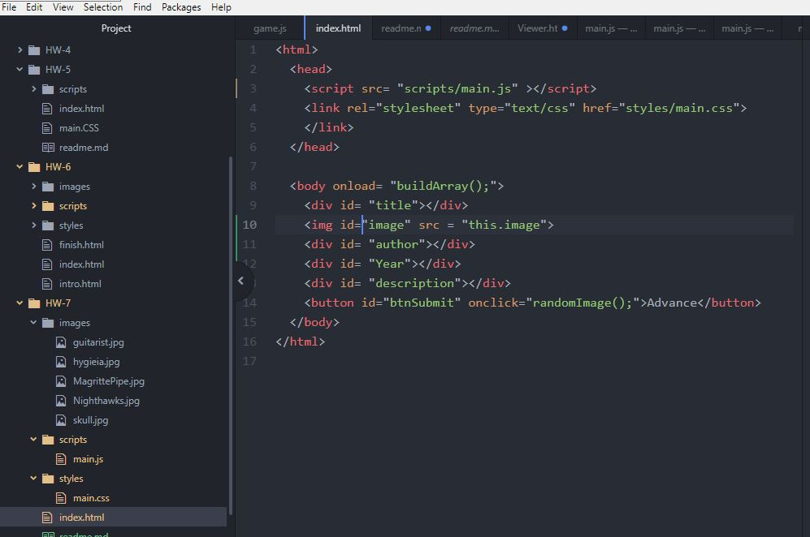

## Week 7!

This week went relatively smoothly. I always approach object orientation with a bit of apprehension, but each time I encounter it, it gets easier!

I spent most of my time on debugging once again. My approach with the code was probably not the best as I went full steam ahead and wrote all of my html and javascript in one go and *then* checked my code and had to go in and debug *a lot*.
I also misread the instructions and had to change some things halfway through.

All in all though, it was a good week! 

 
